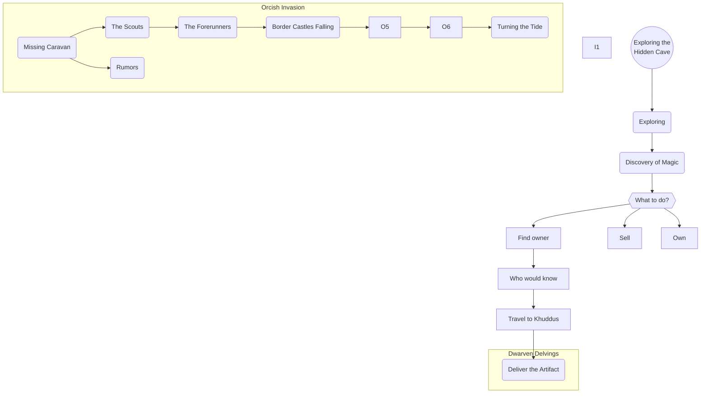

```mermaid
graph TD; 

I1


A((Exploring the </br>Hidden Cave)) --> B(Exploring)    
B --> C1(Discovery  of Magic)
C1 --> C{{What to do?}}
C --> D[Find owner]
C --> E[Sell]
C --> F[Own]

D --> D2[Who would know]


D2 --> Ini1[Travel to Khuddus]    

subgraph OI [Orcish Invasion]
    O1(Missing Caravan)
    O1.1(Rumors)
    O2(The Scouts)
    O3(The Forerunners)
    O4(Border Castles Falling)
    
    O5
    O6
    
    O9(Turning the Tide)
           
    O1 --> O2
    O1 --> O1.1
    O2 --> O3
    O3 --> O4
    O4 --> O5
    O5 --> O6
            
    O6 --> O9
end

subgraph DD [Dwarven Delvings]
    D1(Deliver the Artifact)

end

Ini1 --> D1
```