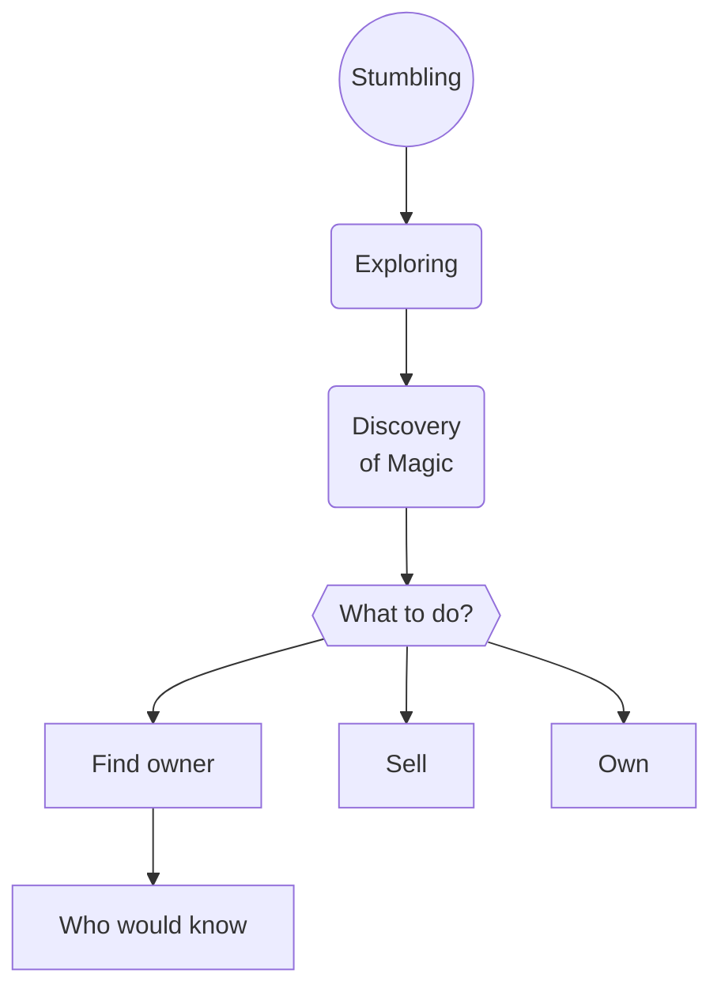

```mermaid
graph TD; 
    A((Stumbling)) --> B(Exploring)
    B --> C1(Discovery </br> of Magic)
    C1 --> C{{What to do?}}
    C --> D[Find owner]
    C --> E[Sell]
    C --> F[Own]
    
    D --> D2[Who would know]
    
    
```
